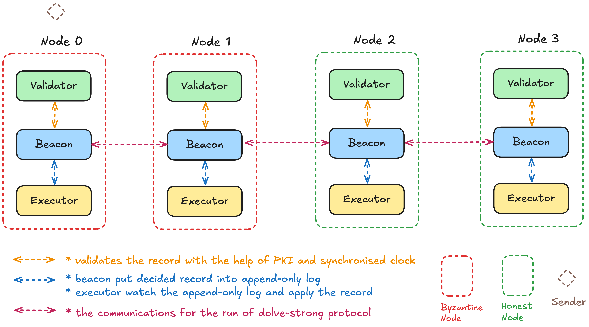
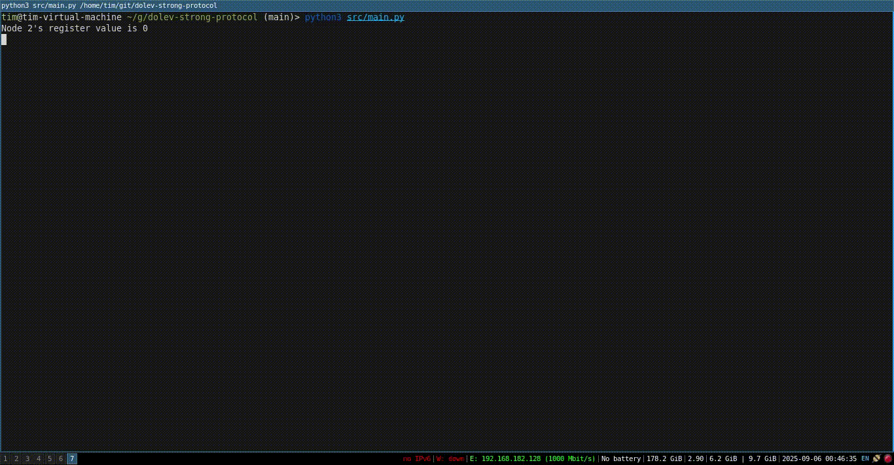
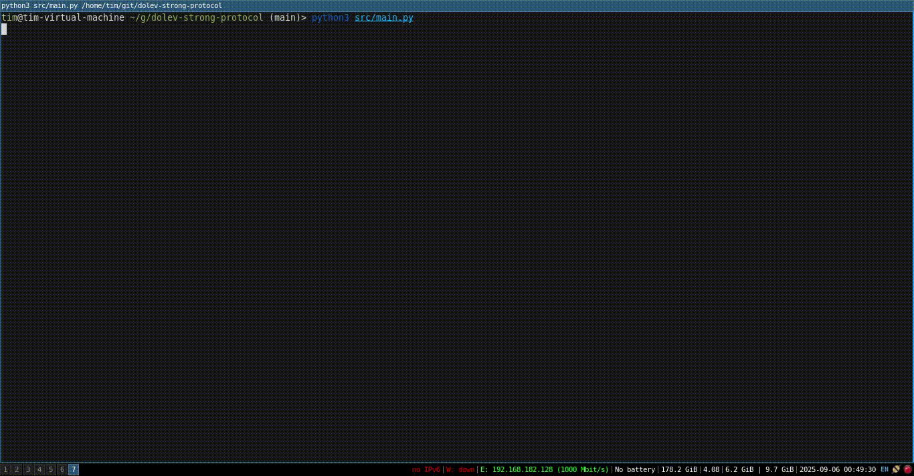

## About

This repository shares my implementation of a toy state machine replication built on top of the dolev-strong protocol for educational purposes.

---

## Overall Design



---

## Repo Structure

```
- **src/**: Contains the main source code for the protocol and state machine.
- **main.py**: Run this script to start a protocol simulation.
- **tests/**: Includes test cases for validating protocol correctness.
- **assets/** & **recording/**: Visual resources for documentation and examples.
```

---

## Example Run

### Understand The Output

The program will output the register value and history(append-only log) of each honest node for each dolev-strong protocol cycle. We should see that all honest nodes have the same register value and history at the end of each cycle.

```bash
Node 0's register value is 0
Node 0's history is []
Node 3's register value is 0
Node 3's history is []
```

### Attack Strategies

- non-sender: does not participate in the protocol
- sender: sometime, send value $v1$ to half of the non-senders and send value $v2$ to another half of the non-senders

### Case 1: 2 Honest Nodes, 2 Faulty Nodes, 1 is the sender and 1 is the non-sender



### Case 2: 2 Honest Nodes, 2 Faulty Nodes, both are non-senders



---

## Dolev-Strong protocol

The dolev-Strong protocol is an authenticated protocol for solving broadcast, against any adversary controlling *t<n* out of *n* parties, in *t+1* rounds.

### Assumptions

1. **Permissioned**: a prior known set of nodes $\{1, 2, 3, ..., n\}$.
1. **Public Key Infrastructure**: each node has a pair of $pk_i$, $sk_i$ where $pk_i$ is known to all nodes upfront.
1. **Synchronous Network**: 
    1. all nodes share a global clock, time steps from $\{0, 1, 2, ...\}$.
    1. the message sent from time $t$ will be arrived at time $t+1$ (in some arbitrary order).
1. **Node Failure**: there are $f$ number of nodes that can be byzantine.

---

## References

1. https://decentralizedthoughts.github.io/2019-12-22-dolev-strong/
1. https://www.cs.umd.edu/~jkatz/gradcrypto2/NOTES/lecture26.pdf
1. https://elaineshi.com/docs/blockchain-book.pdf
